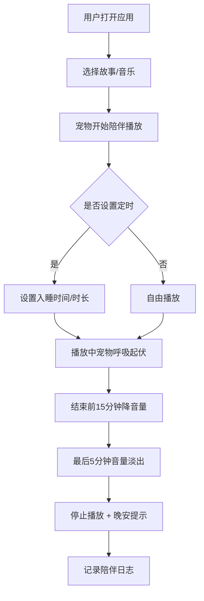
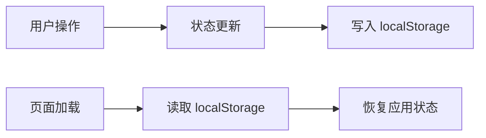

## 1. 产品概述

「睡前故事角」是一款专为睡前时光设计的 Web 应用，通过圆嘟嘟的电子宠物陪伴、温馨的睡前故事和舒缓的助眠音乐，为用户营造温和的入睡氛围。应用采用低对比度夜间配色，默认进入即为夜间模式，避免强光刺激眼睛。

- **目标用户**：有入睡困难的人群，喜欢睡前听故事或白噪音的用户
- **核心价值**：以可爱宠物陪伴 + 沉浸式音频体验，帮助用户放松身心、安然入睡
- **产品定位**：轻量级、治愈系的睡前助眠 Web 应用

## 2. 核心功能

### 2.1 用户角色

| 角色 | 注册方式 | 核心权限 |
|------|----------|----------|
| 普通用户 | 无需注册，本地使用 | 浏览故事、播放音乐、设置定时、查看日志 |

### 2.2 功能模块

1. **故事书架**：分类展示童话故事、自然故事、白噪音解说等，支持播放与文稿同步
2. **音乐电台**：提供多种助眠音轨，支持多轨混音与预设方案一键切换
3. **定时入睡**：设置总时长或目标时间，支持音量淡出与晚安提示
4. **陪伴日志**：日历视图记录入睡计划完成情况，连续打卡解锁宠物外观

### 2.3 页面详情

| 页面名称 | 模块名称 | 功能描述 |
|----------|----------|----------|
| 主应用 | 底部导航 | 四个功能分区切换：故事书架、音乐电台、定时入睡、陪伴日志 |
| 主应用 | 宠物陪伴 | 圆嘟嘟电子宠物常驻界面，播放中随音量呼吸起伏 |
| 主应用 | 播放器 | 底部迷你播放器，支持播放/暂停、进度、音量控制 |
| 故事书架 | 分类列表 | 童话/自然/白噪音分类展示，含时长、适龄标签、推荐语 |
| 故事书架 | 故事播放 | 文稿滚动展示、当前句高亮、上一篇/下一篇切换 |
| 音乐电台 | 音轨列表 | 雨声/篝火/星空等音轨，支持独立音量调节 |
| 音乐电台 | 混音预设 | 深度睡眠/浅眠/仅白噪音三种预设方案一键切换 |
| 定时入睡 | 时间设置 | 总播放时长或目标关闭时间设置 |
| 定时入睡 | 淡出效果 | 最后5分钟音量线性淡出，结束后展示晚安全屏 |
| 陪伴日志 | 日历视图 | 标记每晚入睡计划完成情况 |
| 陪伴日志 | 详情查看 | 点击日期查看当晚播放内容与陪伴时长 |
| 陪伴日志 | 成就解锁 | 连续7天完成计划解锁星空被子宠物外观 |

## 3. 核心流程

### 3.1 用户睡前使用流程

用户打开应用 → 选择故事或音乐 → 宠物陪伴播放 → 设置定时入睡 → 音量渐弱 → 安然入睡 → 次日查看陪伴日志

### 3.2 数据持久化流程

## 4. 用户界面设计

### 4.1 设计风格

- **设计理念**：温柔治愈的夜间美学，像月光洒在枕边一样柔和
- **主色调**：深靛蓝背景 (#0f172a) + 柔紫色点缀 (#a78bfa) + 月光白文字 (#e2e8f0)
- **辅助色**：星云粉 (#f9a8d4)、静谧蓝 (#93c5fd)、萤火绿 (#86efac)
- **整体风格**：低对比度、柔和渐变、圆润边角、毛玻璃效果
- **按钮风格**：大圆角、柔和阴影、悬停微放大
- **字体**：圆润可爱的展示字体 + 清晰易读的正文字体
- **图标风格**：线性图标，柔和线条，统一圆角
- **动效**：缓慢呼吸、轻柔浮动、渐变过渡

### 4.2 页面设计概览

| 页面名称 | 模块名称 | UI 元素 |
|----------|----------|---------|
| 主布局 | 顶部栏 | 应用标题「睡前故事角」、宠物状态指示 |
| 主布局 | 底部导航 | 四个图标+文字的 Tab 切换 |
| 主布局 | 宠物区域 | 圆嘟嘟侧卧宠物，闭眼呼吸动画 |
| 故事书架 | 分类标签 | 横向滚动的分类标签，选中态高亮 |
| 故事书架 | 故事卡片 | 封面、标题、时长、标签、宠物推荐语 |
| 故事书架 | 播放页 | 大封面、文稿滚动区、进度条、控制按钮 |
| 音乐电台 | 音轨卡片 | 图标、名称、开关、音量滑块 |
| 音乐电台 | 预设按钮 | 三个预设方案，一键切换 |
| 定时入睡 | 时间选择器 | 时长滑块 + 目标时间选择 |
| 定时入睡 | 倒计时显示 | 大号数字显示剩余时间 |
| 陪伴日志 | 日历视图 | 月历格子，完成日期标记点亮 |
| 陪伴日志 | 成就卡片 | 连续天数、已解锁外观 |

### 4.3 响应式设计

- **设计原则**：移动端优先，桌面端优化
- **断点设置**：移动端 (< 640px)、平板 (640px - 1024px)、桌面 (> 1024px)
- **移动端适配**：底部导航固定、触摸优化、单手可达区域设计
- **触摸优化**：按钮最小 44px 点击区域，滑动手势支持

### 4.4 宠物动画设计

- **默认姿态**：圆嘟嘟侧卧，眼睛微闭，缓慢呼吸起伏
- **播放状态**：随音乐音量大小调整呼吸幅度，音量大起伏大
- **已入睡**：故事结束后宠物进入深度睡眠姿态，呼吸更慢更轻
- **解锁外观**：星空被子 - 宠物身上覆盖闪烁星光的小被子
- **互动效果**：点击宠物会轻轻晃动，发出轻柔的「呼噜」反馈

## 5. 特殊交互需求

### 5.1 键盘快捷键

- 空格键：播放/暂停
- 左方向键：快退 10 秒
- 右方向键：快进 10 秒

### 5.2 异常处理

- 音频加载失败显示重试按钮，不影响其他音轨
- 定时中关闭标签页，再次打开时询问是否恢复

### 5.3 浏览器限制

- 移动端处理自动播放限制，首次用户交互后再启动音频上下文
