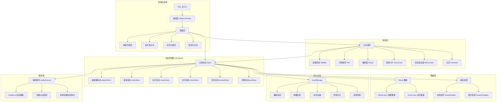

## 1. 架构设计



## 2. 技术栈说明

### 2.1 前端技术

- **框架**: React 18 + TypeScript
- **构建工具**: Vite 5
- **样式方案**: Tailwind CSS 3
- **状态管理**: Zustand
- **路由**: React Router DOM 6
- **图标库**: Lucide React
- **音频播放**: Howler.js (支持多轨混音、音量控制、淡出效果)

### 2.2 选型理由

- **React + TypeScript**: 类型安全，组件化开发，生态丰富
- **Vite**: 开发体验好，构建速度快
- **Tailwind CSS**: 快速开发，统一设计系统，响应式方便
- **Zustand**: 轻量级状态管理，API 简洁，支持中间件持久化
- **Howler.js**: 专业的 Web Audio API 封装，天然支持多轨混音和音量控制

## 3. 目录结构

```
src/
├── assets/              # 静态资源
│   ├── audio/          # 音频文件
│   │   ├── stories/    # 故事音频
│   │   └── music/      # 音乐音轨
│   ├── images/         # 图片资源
│   └── data/           # Mock JSON 数据
│       ├── stories.json
│       └── music.json
├── components/         # 公共组件
│   ├── TabBar/         # 底部导航
│   ├── Pet/            # 宠物组件
│   ├── Player/         # 播放器组件
│   ├── StoryCard/      # 故事卡片
│   ├── MixerTrack/     # 混音音轨
│   ├── Calendar/       # 日历组件
│   └── GoodNight/      # 晚安提示
├── pages/              # 页面组件
│   ├── StoryShelf/     # 故事书架
│   ├── MusicRadio/     # 音乐电台
│   ├── SleepTimer/     # 定时入睡
│   └── Journal/        # 陪伴日志
├── store/              # Zustand 状态管理
│   ├── playerStore.ts
│   ├── storyStore.ts
│   ├── musicStore.ts
│   ├── timerStore.ts
│   ├── journalStore.ts
│   └── petStore.ts
├── hooks/              # 自定义 Hooks
│   ├── useAudio.ts
│   ├── useTimer.ts
│   ├── useKeyboard.ts
│   └── useLocalStorage.ts
├── utils/              # 工具函数
│   ├── formatTime.ts
│   ├── storage.ts
│   └── audio.ts
├── types/              # TypeScript 类型定义
│   ├── story.ts
│   ├── music.ts
│   ├── player.ts
│   ├── journal.ts
│   └── pet.ts
├── App.tsx
├── main.tsx
└── index.css
```

## 4. 路由定义

| 路由路径 | 页面名称 | 说明 |
|----------|----------|------|
| `/` | 故事书架 | 默认首页，展示故事分类列表 |
| `/music` | 音乐电台 | 多轨混音播放控制 |
| `/timer` | 定时入睡 | 定时设置与倒计时 |
| `/journal` | 陪伴日志 | 日历视图与成就展示 |

## 5. 数据模型

### 5.1 故事数据模型

```typescript
interface Story {
  id: string;
  title: string;
  category: 'fairy' | 'nature' | 'whitenoise';
  duration: number; // 秒
  ageRange: string; // 适龄标签
  petRecommendation: string; // 宠物推荐语
  coverImage: string;
  audioUrl: string;
  script: StoryScriptLine[]; // 文稿
}

interface StoryScriptLine {
  id: string;
  text: string;
  startTime: number; // 开始时间（秒）
  endTime: number; // 结束时间（秒）
}
```

### 5.2 音乐数据模型

```typescript
interface MusicTrack {
  id: string;
  name: string;
  category: 'rain' | 'fire' | 'stars' | 'ocean' | 'forest';
  icon: string;
  audioUrl: string;
  defaultVolume: number; // 0-1
}

interface MixPreset {
  id: string;
  name: string;
  description: string;
  tracks: { trackId: string; volume: number }[];
}
```

### 5.3 陪伴日志模型

```typescript
interface JournalEntry {
  date: string; // YYYY-MM-DD
  completed: boolean;
  stories: PlayedStory[];
  musicTracks: string[];
  totalDuration: number; // 分钟
  sleepPlan: {
    targetTime: string;
    actualDuration: number;
  };
}

interface PlayedStory {
  storyId: string;
  title: string;
  duration: number;
  playedAt: string;
}
```

### 5.4 宠物状态模型

```typescript
interface PetState {
  name: string;
  mood: 'awake' | 'sleepy' | 'sleeping';
  unlockedSkins: string[];
  currentSkin: string;
  breathingRate: number; // 呼吸频率
  breathingDepth: number; // 呼吸深度
}
```

## 6. 核心功能实现方案

### 6.1 多轨混音播放

使用 Howler.js 的 Howl 实例，每个音轨创建独立的 Howl 对象：
- 支持同时播放最多 3 轨
- 每轨独立音量控制
- 预设方案一键加载
- 音频加载失败重试机制

### 6.2 音量淡出效果

使用 requestAnimationFrame 实现平滑的音量淡出：
- 最后 5 分钟开始线性淡出
- 基于当前音量和剩余时间计算递减速率
- 支持暂停/恢复淡出过程

### 6.3 入睡计划

- 设定目标入睡时间
- 结束前 15 分钟自动降低音量 30%
- 结束前 5 分钟切换为纯音乐模式（停止故事）
- 到时停止所有播放，展示晚安全屏

### 6.4 localStorage 持久化

使用 Zustand 的 persist 中间件：
- 自动序列化状态到 localStorage
- 页面加载时自动恢复
- 支持部分状态持久化

### 6.5 键盘快捷键

- 监听全局 keydown 事件
- 空格键：切换播放/暂停
- 左方向键：快退 10 秒
- 右方向键：快进 10 秒
- 焦点在输入框时不触发

### 6.6 宠物动画

- CSS @keyframes 实现呼吸效果
- 根据播放音量动态调整呼吸幅度
- 故事结束后切换为睡眠姿态
- 解锁星空被子皮肤：添加闪烁星光效果

## 7. 性能与体验优化

### 7.1 音频优化

- 预加载首屏音频
- 按需加载非当前播放音频
- 音频缓存策略
- 加载失败重试机制

### 7.2 动画优化

- 使用 CSS transform 和 opacity 实现硬件加速
- 减少重排重绘
- 移动端降低动画复杂度

### 7.3 移动端适配

- viewport 适配
- 触摸事件优化
- 自动播放限制处理（首次交互后启动 AudioContext）
- 横屏/竖屏适配
